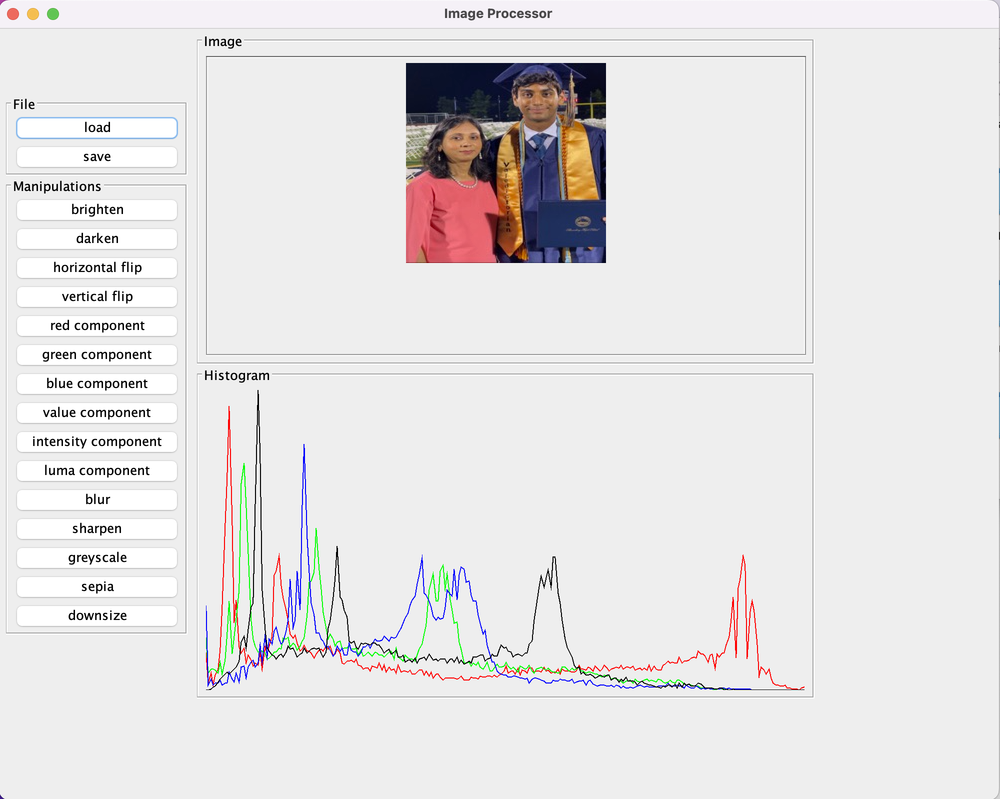

# **Image Manipulator**

### **Contributors**  

#### Aryan Kale - Khoury College Of Computer Science, Northeastern University  

#### Anshul Shirude - Khoury College of Computer Science & College of Science, Northeastern University  

### **Description**  
Image Manipulator is a Java image processing application with text-based, GUI, and command line functionality. It currently contains 10+ features including: uploading an image, saving an image to a device, flipping (vertical and horizontal), brightening/dimming, greyscaling, blurring, sharpening, applying a sepia filter, and downsizing an image. The application currently allows users to load or save an image in the formats .jpg, jpng, .ppm, and .bmp. When using the GUI, a histogram also displays the frequencies of each value (between 0-255) for the red, green, and blue values of each pixel. All functionality has been properly tested with JUnit.

### **Final Product**  
The GUI is shown below.

### **How to Run the Program with the Text-Based Functionality**  

Instructions on how to perform image manipulations on the family.ppm file located in the res/ folder.

In order to run this script using our program, one can run the main method within the ImageProcessingProgram class and enter the scripts in the console. All commands should be entered on a new line. One example of loading and saving the family image from a ppm to a ppm,  png, jpg, and bmp is displayed below. The same rules apply if you want to load from a different format and save in a different format.

The lines above the scripts  represent explanations of what the scripts themselves do.

####load family.ppm and call it 'family'  
`load res/family/family.ppm family`

####brighten family by adding 10 to the components of the pixels (must be value greater than 0 to brighten)  
`brighten 10 family family-brighter`

####darken family by subtracting 10 to the components of the pixels (must be value greater than 0 to darken)  
`darken 10 family family-darker`

####flip family vertically  
`vertical-flip family family-vertical`

####lip family horizontally  
`horizontal-flip family family-horizontal`

####flip the vertically-flipped family horizontally  
`horizontal-flip family-vertical family-vertical-horizontal`

####create a greyscale using only the red component, as an image family-red-greyscale  
`red-component family family-red-greyscale`

####create a greyscale using only the green component, as an image family-green-greyscale  
`green-component family family-green-greyscale`

####create a greyscale using only the blue component, as an image family-blue-greyscale  
`blue-component family family-blue-greyscale`

####create a greyscale using only the value component, as an image family-value-greyscale  
`value-component family family-value-greyscale`

####create a greyscale using only the intensity component, as an image family-intensity-greyscale  
`intensity-component family family-intensity-greyscale`

####create a greyscale using only the luma component, as an image family-luma-greyscale  
`luma-component family family-luma-greyscale`

####blur the image of the family  
`blur family family-blurred`

####sharpening the image of the family  
`sharpen family family-sharpened`

####applying a greyscale to the image of the family  
`greyscale family family-greyscale`

####applying a sepia tone to the image of the family  
`sepia family family-sepia`

####save family-brighter in the ppm format in the res/family/ directory  
`save res/family/family-brighter.ppm family-brighter`

####save family-brighter in the png format  
`save family-brighter.png family-brighter`

####save family-brighter in the jpg format  
`save family-brighter.jpg family-brighter`

####save family-brighter in the bmp format  
`save family-brighter.bmp family-brighter`

####save family-value-greyscale  
`save res/family/family-gs.ppm family-value-greyscale`

####save the family blurred image  
`save family-blurred.ppm family-blurred`

####save the family sharpened image  
`save family-sharpened.ppm family-sharpened`

####save the family with the greyscale image color transformation  
`save family-greyscale.ppm family-greyscale`

####save the family with the sepia image color transformation  
`save family-sepia.ppm family-sepia`

####overwrite family in the model with another file  
`load res/Square.ppm family`

####q to quit the program  
`q`
 
 